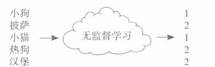
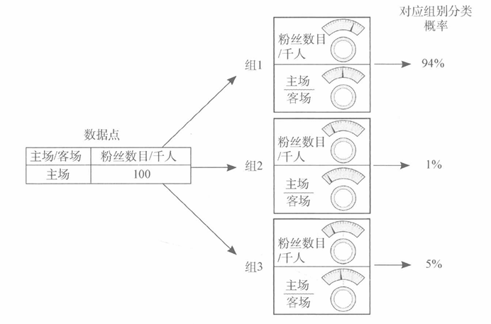

## 2.2 什么是机器学习

## 2.3 监督机器学习
把我知道的作为输入，转换成我想知道的

- 用像素来检测猫是否存在 
- 用喜欢的电影来预测可能喜欢 
- 用今天股价 ->(Supervised learning)明天股价

## 2.4 无监督机器学习
对数据进行分组

在这些数据中找到某种模式，告诉我它是什么

## 2.5 参数学习和非参数学习
试错学习 vs. 计数和概率

## 2.6 监督参数学习
按钮指的是通过旋转选择数据(参数)来进行学习

根据参数(已知数据),处理→转换为预测结果

如果某一个预测依据在结果表现良好,则调高;反之调低(按钮)

步骤:预测→与真值比较→学习模式(调整/调参?)

## 2.7 无监督参数学习
旋转按钮对数据进行分组

## 2.8 非参数学习
基于计数的方法;以数据为基础的算法
