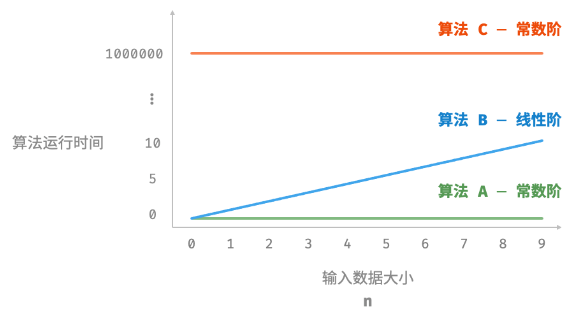
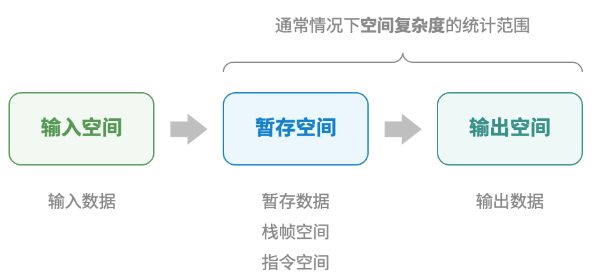

# 2.1   算法效率评估
算法设计目标
- 找到解法
- 寻找最优解法

评价指标:
- 时间效率:算法与性能时间
- 空间效率:算法占用内存空间

评估方法:
- 实际测试
跑一遍看看
- 理论估算

## 2.1.2   理论估算
计算估算:复杂度分析
> 复杂度分析能够体现算法运行所需的时间和空间资源与输入数据大小之间的关系。**它描述了随着输入数据大小的增加，算法执行所需时间和空间的增长趋势**。

时间/空间  复杂度

# 2.2   迭代与递归
## 2.2.1   迭代
> 重复执行某个任务的控制结构
比如for循环实现1 - 100求和
```c
/* for 循环 */
int forLoop(int n) {
    int res = 0;
    // 循环求和 1, 2, ..., n-1, n
    for (int i = 1; i <= n; i++) {
        res += i;
    }
    return res;
}
```


## 2.2.2   递归
> 通过函数调用自身来解决问题

两个阶段
1. **递**：程序不断深入地调用自身，通常传入更小或更简化的参数，直到达到“终止条件”。
2. **归**：触发“终止条件”后，程序从最深层的递归函数开始逐层返回，汇聚每一层的结果。

三个要素
1. **终止条件**：用于决定什么时候由“递”转“归”。
2. **递归调用**：对应“递”，函数调用自身，通常输入更小或更简化的参数。
3. **返回结果**：对应“归”，将当前递归层级的结果返回至上一层。

```c
/* 递归 */
int recur(int n) {
    // 终止条件
    if (n == 1)
        return 1;
    // 递：递归调用
    int res = recur(n - 1);
    // 归：返回结果
    return n + res;
}
```


- **迭代**：“自下而上”地解决问题。从最基础的步骤开始，然后不断重复或累加这些步骤，直到任务完成。
- **递归**：“自上而下”地解决问题。将原问题分解为更小的子问题，这些子问题和原问题具有相同的形式。接下来将子问题继续分解为更小的子问题，直到基本情况时停止（基本情况的解是已知的）。

设问题 𝑓(𝑛)=1+2+⋯+𝑛 。

- **迭代**：在循环中模拟求和过程，从 1 遍历到 𝑛 ，每轮执行求和操作，即可求得 𝑓(𝑛) 。
- **递归**：将问题分解为子问题 𝑓(𝑛)=𝑛+𝑓(𝑛−1) ，不断（递归地）分解下去，直至基本情况 𝑓(1)=1 时终止。

# 2.3   时间复杂度
## 2.3.1   统计时间增长趋势
**算法运行时间随着数据量变大时的增长趋势**



# 2.4   空间复杂度
**算法占用内存空间随着数据量变大时的增长趋势**

内存空间主要包括
- **输入空间**:存储算法的输入数据
- **暂存空间**:存储算法在运行过程中的变量、对象、函数上下文等数据
- **输出空间**:存储算法的输出数据

一般情况下，空间复杂度的统计范围是“暂存空间”加上“输出空间”
暂存空间可分为:
- **暂存数据**：保存算法运行过程中的各种常量、变量、对象等。
- **栈帧空间**：保存调用函数的上下文数据。系统在每次调用函数时都会在栈顶部创建一个栈帧，函数返回后，栈帧空间会被释放。
- **指令空间**：用于保存编译后的程序指令，在实际统计中通常忽略不计。



```c
//相关代码
/* 函数 */
int func() {
    // 执行某些操作...
    return 0;
}

int algorithm(int n) { // 输入数据
    const int a = 0;   // 暂存数据（常量）
    int b = 0;         // 暂存数据（变量）
    int c = func();    // 栈帧空间（调用函数）
    return a + b + c;  // 输出数据
}
```