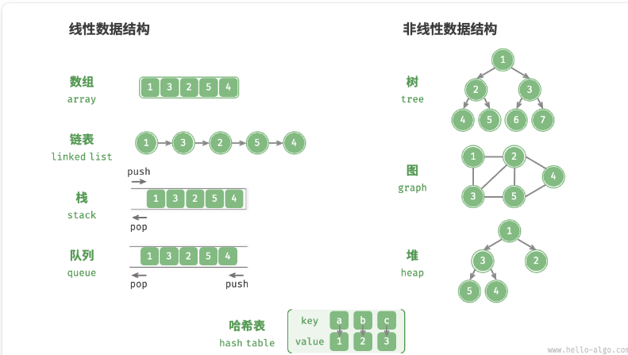
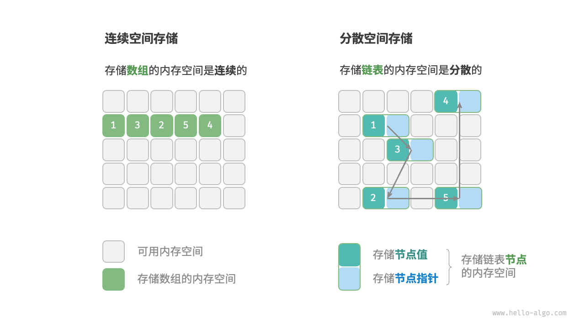

## 3.1   数据结构分类

常见有:数组、链表、栈、队列、哈希表、树、堆、图
**逻辑结构**和**物理结构**

### 3.1.1   逻辑结构：线性与非线性

**数据元素之间的逻辑关系**
比如数组和链表，按照一定顺序排列，线性
树，自顶向下按层排列
图，节点和变构成，复杂的网络关系

### 3.1.2   物理结构：连续与分散

**当算法程序运行时，正在处理的数据主要存储在内存中**。

**系统通过内存地址来访问目标位置的数据**。
> 计算机根据特定规则为表格中的每个单元格分配编号，确保每个内存空间都有唯一的内存地址。有了这些地址，程序便可以访问内存中的数据。

**物理结构反映了数据在计算机内存中的存储方式**
物理结构从底层决定了数据的访问、更新、增删等操作方法，两种物理结构在时间效率和空间效率方面呈现出互补的特点。

**所有数据结构都是基于数组、链表或二者的组合实现的**。栈和队列既可以使用数组实现，也可以使用链表实现；而哈希表的实现可能同时包含数组和链表。

- **基于数组可实现**：栈、队列、哈希表、树、堆、图、矩阵、张量（维度 ≥3 的数组）等。
- **基于链表可实现**：栈、队列、哈希表、树、堆、图等。

链表在初始化后，仍可以在程序运行过程中对其长度进行调整，因此也称“动态数据结构”。数组在初始化后长度不可变，因此也称“静态数据结构”。值得注意的是，数组可通过重新分配内存实现长度变化，从而具备一定的“动态性”。

## 3.2   基本数据类型

当谈及计算机中的数据时，我们会想到文本、图片、视频、语音、3D 模型等各种形式。尽管这些数据的组织形式各异，但它们都由各种基本数据类型构成。
**基本数据类型是 CPU 可以直接进行运算的类型**
`byte`、`short`、`int`、`long`、`float`、`double`、`char`、`bool`

**基本数据类型以二进制的形式存储在计算机中**。一个二进制位即为 1 比特。在绝大多数现代操作系统中，1 字节（byte）由 8 比特（bit）组成。

**基本数据类型提供了数据的“内容类型”，而数据结构提供了数据的“组织方式”**

