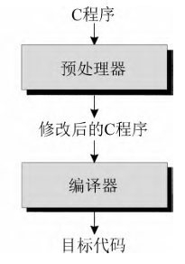

## 14.1 预处理器的工作原理
预处理器的行为是由预处理指令控制的。
例如:
```c
//定义了一个宏;比如常量或常用的表达式
#define

//打开一个特定的文件,将它的内容作为正在编译的文件的一部分“包含”进来。
#include
```


## 14.2 预处理指令
- 宏定义
```c
//定义一个宏
#define

//删除一个宏定义
#undef 
```
- 文件包含
```c
#include
```
- 条件编译
```c
//根据预处理器可以测试的条件来确定是将一段文本块包含到程序中还是将其排除在程序之外。
#if 、#ifdef 、#ifndef 、#elif 、#else 和#endif
```

- 指令都以#开始

## 14.3 宏定义
### 14.3.1 简单的宏/对象式宏
格式:
```c
[ #define 指令（简单的宏）] 　　 #define 标识符 替换列表

#define STE_LEN 80 
#define TRUE 1 
#define FALSE 0
```

用`#define`定义常量优点:
- 程序易读
- ~易于修改

### 14.3.2 带参数的宏/函数式宏
格式:
```c
[ #define 指令（带参数的宏）] 　　 #define 标识符(x 1 , x2 ,..., xn )替换列表 
```

### 14.3.5 宏的通用属性
- 宏的替换列表可以包含对其他宏的调用
```c
#define PI 3.14159 
#define TWO_PI (2*PI)
```

- 预处理器只会替换完整的记号，而不会替换记号的片断

也就是说拼接常量名并不会有预期影响
```c
#define SIZE 256 int BUFFER_SIZE; 
if (BUFFER_SIZE > SIZE) 
	puts("Error ： SIZE exceeded");

//预处理后:
int BUFFER_SIZE; 
if (BUFFER_SIZE > 256) 
	puts("Error: SIZE exceeded");

```

- 宏定义的作用范围通常到出现这个宏的文件末尾
- 宏不可以被定义两遍，除非新的定义与旧的定义是一样的
- 宏可以使用#undef 指令“取消定义”
```c
[ #undef 指令] 　　 #undef 标识符
//删除宏N当前的定义;如果没有定义则指令没作用
#undef N
```