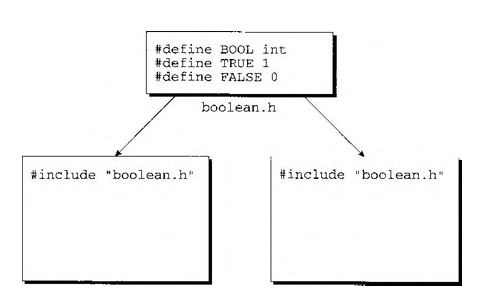
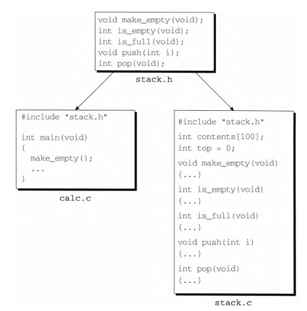

## 15.1 源文件
`.c`文件:主要包含函数和变量的定义
一定有一个源文件包含`main`函数,作为程序的起始点.

把程序分成多个源文件优点:
- 函数和变量分组放在同一个文件中让程序结构更清晰
- 可以分别对每一个源文件进行编译;节约时间
- 函数分在不同的源文件更利于复用

## 15.2 头文件
`.h`文件
定义函数 声明变量
用`#include`指令来共享函数、宏定义、类型定义

### 15.2.1 #include指令
格式:
```c
//c语言自身库的头文件
[ #include 指令（格式1）] 　　 #include <文件名>

//所有其它头文件，自己编写的文件
[ #include 指令（格式2）] 　　 #include "文件名"
```

规则:
- #include <文件名> ：搜寻系统头文件所在的目录（或多个目 录）。（例如，在UNIX系统中，通常把系统头文件保存在目 录/usr/include 中。） 
- #include "文件名" ：先搜寻当前目录，然后搜寻系统头文件 所在的目录（或多个目录）。

```c
#include "c:\cprogs\utils.h" /* Windows path */ #include "/cprogs/utils.h" /* UNIX path */
```


### 15.2.2 共享宏定义和类型定义
```c
//boolean.h
#define BOOL int 
#define TRUE 1 
#define FALSE 0

//需要则include
#include "boolean.h"
```



### 15.2.3　共享函数原型


### 15.2.4　共享变量声明
```c
//使编译器为i留出空间
int i; /* declares i and defines it as well */

extern int i; /* declares i without defining it */
```

